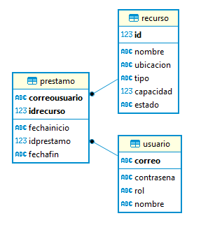
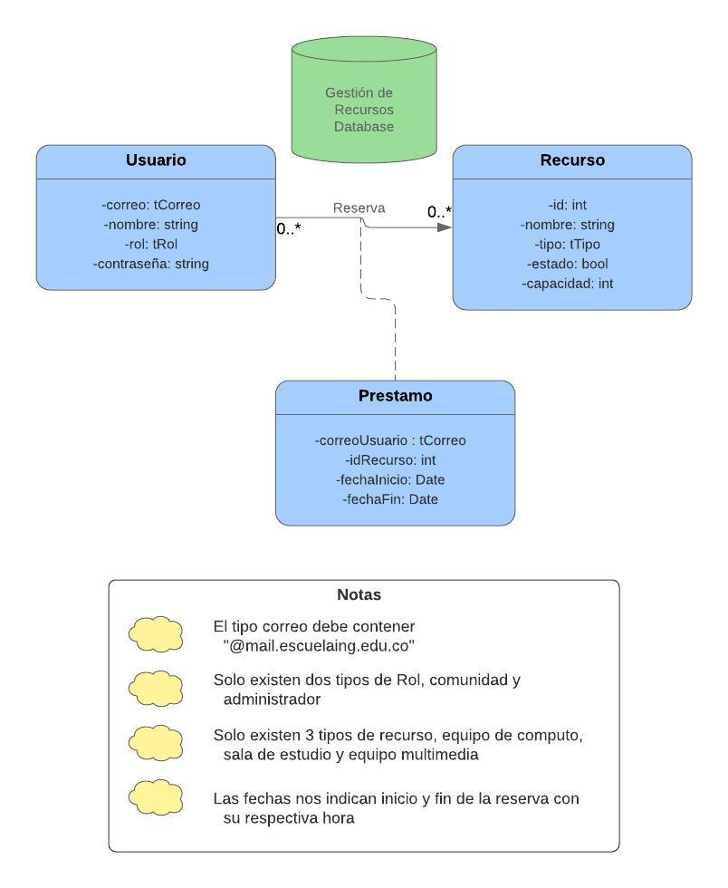

# Plataforma Gestión de Recursos Biblioteca
Esta es una aplicación para el control, administración y manejo de de los recursos que ofrece la biblioteca de la Escuela Colombiana de Ingeniería Julio Garavito.

**Curso:** Ciclos de Vida del Desarrollo de Software \
**Periodo académico:** 2019-2

## Integrantes y Roles

|     Nombre    |     Rol         |
|:--------------:|:-------------: |
|Santiago Alzate |Product Owner    |
|Carlos Murillo |Team Developer   |
|Yeisson Gualdron |Team Developer   |
|Miguel Castellanos |Team Developer   |

## Estado del Proyecto

## Descripción del Producto

#### Descripción General
Esta aplicación tiene como objetivo principal brindar una herramienta facil y eficiente para tener un manejo de los recursos ofrecidos por la biblioteca, además de brindar la opción de reservar dicho elemento sin ningun contratiempo el tiempo que el usuario lo necesite 

#### Manual de Usuario
Para poder utilizar todos los servicios que ofrece la aplicación es necesario realizar un inicio de sesión para esto ofresemos las credenciales de administrador:
+ **Usuario:** *admin@admin.com*
+ **Contraseña:** *12345*

## Arquitectura y Diseño
#### Modelo E-R

#### Modelo Base de Datos

Stack de Tecnologías:
   * [PrimeFaces (Framework)](https://www.primefaces.org/)
   * [Guice (Inyección de Dependencias)](https://github.com/google/guice)
   * [Bootstrap (Web Toolkit)](https://getbootstrap.com/)
   * PostgreSQL (DataBase Management)

#### Enlaces
+ [Despliegue en Heroku](https://cvds-proyecto.herokuapp.com/)
+ [Integración Continua (CircleCI)](https://circleci.com/gh/2019-2-PROYCVDS-2LATE/Proyecto2Late)

## Descripción del Proceso
#### Integrantes
|     Nombre    |     Rol         |
|:--------------:|:-------------: |
|Carlos Murillo |Team Developer   |
|Yeisson Gualdron |Team Developer   |
|Miguel Castellanos |Team Developer   |

#### Metodología
En este proyecto utilizamos la metodoloía Scrum en la cual
el equipo se reune y planea lo que se realizará en los diferentes 
Sprint, la herramienta que se utilizo fue Taigo.io la cual nos
permite realizar la historiade usuario y se reparte las tareas 
entre los integrantes.
 
 Al finalizar cada Sprint, el equipo se reune para planear el siguiente y
 se comentan lo que sucedió con el anterior.
 
#### Taiga
[Taiga backlog](https://tree.taiga.io/project/camu10-gestion-de-recursos-biblioteca/backlog)

## Sprints
Ver la documentación de los [sprints](resources/sprints/Sprints.md)