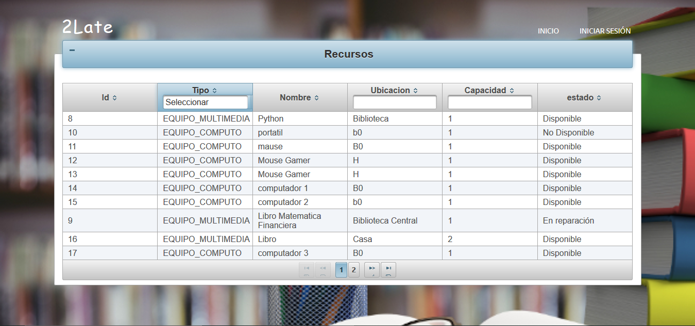
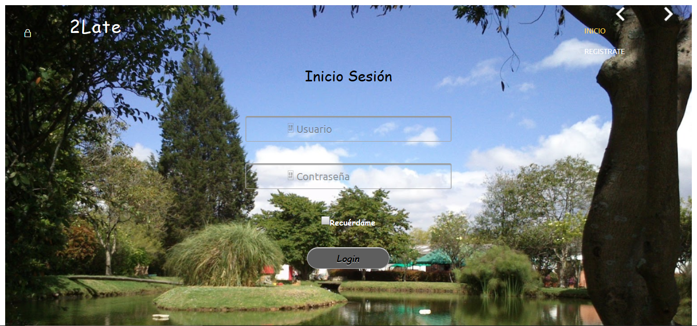
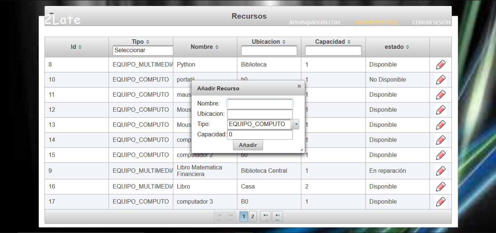
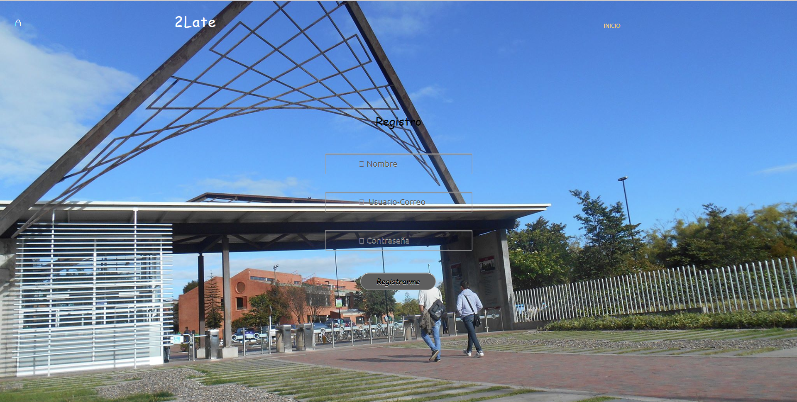
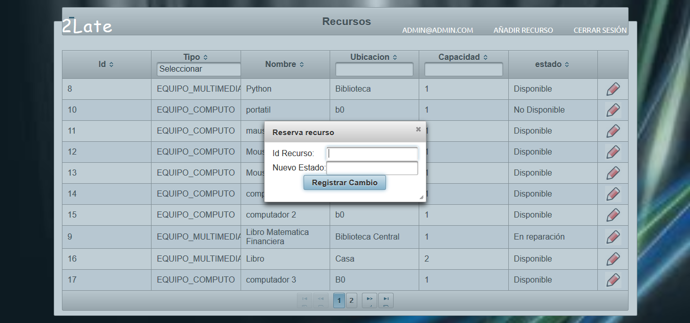
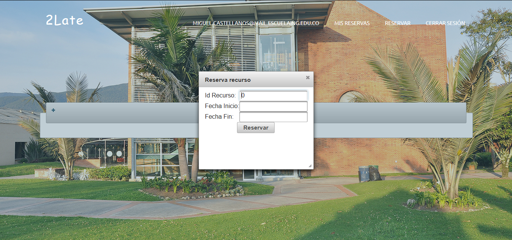
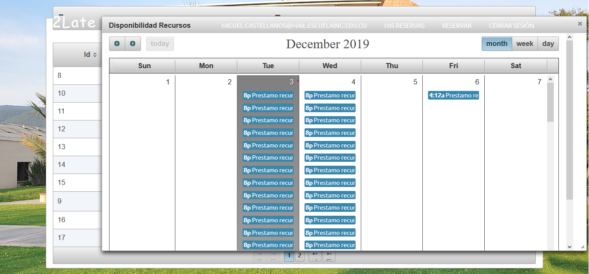
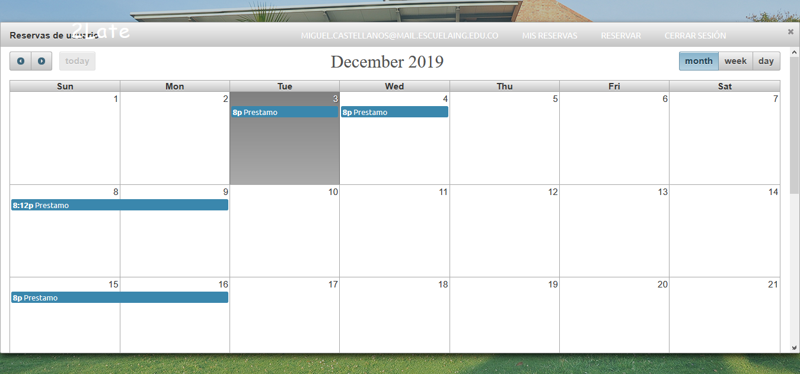

# Funcionalidades Importantes 

## Consultar recursos
Podemos consultar los recursos sin la necesidad de estar con una sesión activa.

## Inicio de Sesión
Aqui el usuario puede realizar su inicio de sesión con sus credenciales.

## Registrar

### Registrar Recurso
Esta opción solo pueder ser usada por el administrador, allí puede seleccionar el tipo de recurso y rellenar los campos necesario. Al usuario también se le muestra los elementos registrados en la base de datos en la parte de atras.

### Registrar Usuario
Esta nos permite registrar un usuario.

## Modificar

### Modificar estado del recurso
En esta opción damos la facilidad de modificar el estado de un recurso.

## Realizar una reserva
En esta parte se puede realizar una reserva de cualquier recurso disponible

## Disponibilidad de recurso
Podemos consultar la disponibilidad de cada resurso

## Reservas por usuario
Aqui podemos ver las reservas que tiene el usuario activas

