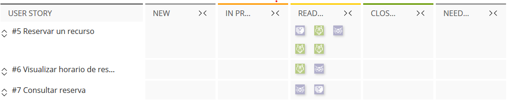
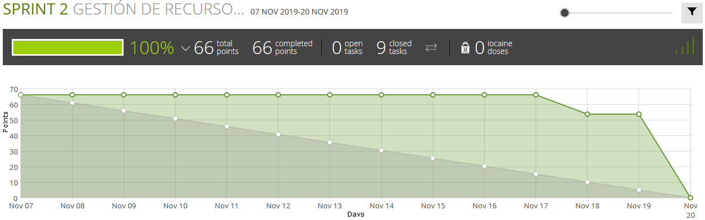
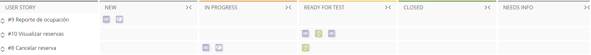
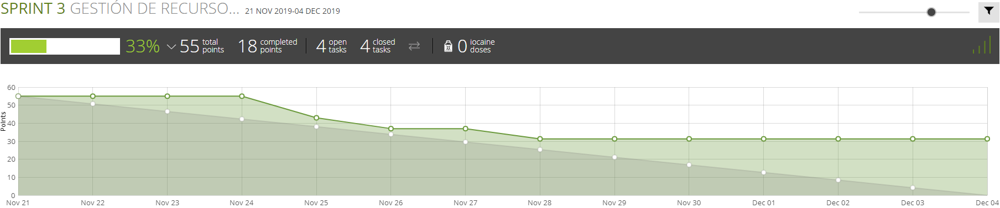

# Sprints
### Sprint 1
**Sprint-backlog**\

**Sprint-burndown chart**\

##### Resumen del sprint
Para este primer sprint nos descuidamos en la realizacion de las tareas por los cual podemos apreciar en el burndown-chart 
que se empezo a trabajar a lo ultimo y no alcanzamos a realizar todos los requerimentos en las fechas establecidas aunque si se 
completo este sprint.

### Sprint 2
**Sprint-backlog**\

**Sprint-burndown chart**\

##### Resumen del sprint
Para este sprint nos sucedio lo mismo que en el primero por los cual nos toco realizar las tareas lo mas rapido posible 
para poder terminarlo a tiempo lo cual lo podemos obseravar en el burndown-chart, además nos faltaron ciertas tareas por 
completar.

### Sprint 3
**Sprint-backlog**\

**Sprint-burndown chart**\

##### Resumen del sprint
Para este sprint no logramos completarlo completo.
